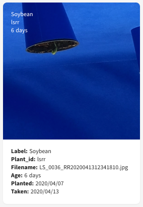

# Creating a dataset

## Schema of the dataset

| filepath | label | Group |
| -------- | ----- | ----- |
|          |       | G\*   |

## Available Plants in the db

| label          | count  |
| -------------- | ------ |
| Pink Bean      | 23447  |
| Kidney Bean    | 47731  |
| Navy Bean      | 21826  |
| Black Bean     | 19673  |
| Kidney Bean    | 47731  |
| Pinto Bean     | 22743  |
| Cranberry Bean | 22892  |
| FieldPea       | 55553  |
| Smartweed      | 104660 |
| CanadaThistle  | 112658 |
| Dandelion      | 108713 |
| Soybean        | 183663 |
| Canola         | 229517 |
| Wheat          | 90632  |
| YellowFoxtail  | 22222  |
| Oat            | 27025  |
| WildOat        | 12351  |
| BarnyardGrass  | 114874 |

```json
[
  { "label": "Pink Bean", "count": 23447 },
  { "label": "Kidney Bean", "count": 47731 },
  { "label": "Navy Bean", "count": 21826 },
  { "label": "Black Bean", "count": 19673 },
  { "label": "Kidney Bean", "count": 47731 },
  { "label": "Pinto Bean", "count": 22743 },
  { "label": "Cranberry Bean", "count": 22892 },
  { "label": "FieldPea", "count": 55553 },
  { "label": "Smartweed", "count": 104660 },
  { "label": "CanadaThistle", "count": 112658 },
  { "label": "Dandelion", "count": 108713 },
  { "label": "Soybean", "count": 183663 },
  { "label": "Canola", "count": 229517 },
  { "label": "Wheat", "count": 90632 },
  { "label": "YellowFoxtail", "count": 22222 },
  { "label": "Oat", "count": 27025 },
  { "label": "WildOat", "count": 12351 },
  { "label": "BarnyardGrass", "count": 114874 }
]
```

## First layer mapping

First, I have merged all Beans into one and re-labeled all records according to the following table.

| label          | label_h        |
| -------------- | -------------- |
| Pink Bean      | Bean           |
| Kidney Bean    | Bean           |
| Navy Bean      | Bean           |
| Black Bean     | Bean           |
| Kidney Bean    | Bean           |
| Pinto Bean     | Bean           |
| Cranberry Bean | Bean           |
| FieldPea       | Field Pea      |
| Wild BuckWheat | Wild Buckwheat |
| Smartweed      | Smartweed      |
| CanadaThistle  | Canada Thistle |
| Dandelion      | Dandelion      |
| Soybean        | Soybean        |
| Canola         | Canola         |
| Wheat          | Wheat          |
| YellowFoxtail  | Yellow Foxtail |
| Oat            | Oat            |
| WildOat        | Wild Oat       |
| BarnyardGrass  | Barnyard Grass |

```json
[
  { "label": "Pink Bean", "label_h": "Bean" },
  { "label": "Kidney Bean", "label_h": "Bean" },
  { "label": "Navy Bean", "label_h": "Bean" },
  { "label": "Black Bean", "label_h": "Bean" },
  { "label": "Kidney Bean", "label_h": "Bean" },
  { "label": "Pinto Bean", "label_h": "Bean" },
  { "label": "Cranberry Bean", "label_h": "Bean" },
  { "label": "FieldPea", "label_h": "Field Pea" },
  { "label": "Wild BuckWheat", "label_h": "Wild Buckwheat" },
  { "label": "Smartweed", "label_h": "Smartweed" },
  { "label": "CanadaThistle", "label_h": "Canada Thistle" },
  { "label": "Dandelion", "label_h": "Dandelion" },
  { "label": "Soybean", "label_h": "Soybean" },
  { "label": "Canola", "label_h": "Canola" },
  { "label": "Wheat", "label_h": "Wheat" },
  { "label": "YellowFoxtail", "label_h": "Yellow Foxtail" },
  { "label": "Oat", "label_h": "Oat" },
  { "label": "WildOat", "label_h": "Wild Oat" },
  { "label": "BarnyardGrass", "label_h": "Barnyard Grass" }
]
```

The reason to merge all Beans into one bucket is the visual similarity and simplifiying the problem at this point.


## Grouping

Images in the dataset are took from seedlings to fully grown and flowering plants. Based on the visual inspection of samples of images we are not selecting any image in which the plant is a seedling or is too old.

Different plants grow at different rates, setting a fixed age to separate seedlings for all plants won't be a good solution. In the context of ML, it should be possible though, to train a model capable of classifying seedlings from adults or even flowering plants, given a prepared dataset. In this thesis, we achieved this through sorting images by age and visually looking for a thresholds for each plant type. Results are showin in the below table along with the assigned groups and the number of images for each label

| label_h        | group | min_age | max_age | count  |
| -------------- | ----- | ------- | ------- | ------ |
| Bean           | G1    | 11      | 43      | 121828 |
| Field Pea      | G1    | 11      | 39      | 37482  |
| Wild Buckwheat | G1    | 12      | 91      | 31721  |
| Smartweed      | G2    | 14      | 67      | 87931  |
| Canada Thistle | G2    | 24      | 91      | 75775  |
| Dandelion      | G2    | 24      | 89      | 82677  |
| Soybean        | G2    | 14      | 66      | 130054 |
| Canola         | G2    | 14      | 65      | 149303 |
| Wheat          | G3    | 10      | 60      | 59661  |
| Yellow Foxtail | G3    | 12      | 89      | 20082  |
| Oat            | G3    | 18      | 44      | 27025  |
| Wild Oat       | G3    | 10      | 48      | 5074   |
| Barnyard Grass | G3    | 18      | 43      | 61591  |

```json
[
  {
    "label_h": "Bean",
    "group": "G1",
    "min_age": "11",
    "max_age": "43",
    "count": "121828"
  },
  {
    "label_h": "Field Pea",
    "group": "G1",
    "min_age": "11",
    "max_age": "39",
    "count": "37482"
  },
  {
    "label_h": "Wild Buckwheat",
    "group": "G1",
    "min_age": "12",
    "max_age": "91",
    "count": "31721"
  },
  {
    "label_h": "Smartweed",
    "group": "G2",
    "min_age": "14",
    "max_age": "67",
    "count": "87931"
  },
  {
    "label_h": "Canada Thistle",
    "group": "G2",
    "min_age": "24",
    "max_age": "91",
    "count": "75775"
  },
  {
    "label_h": "Dandelion",
    "group": "G2",
    "min_age": "24",
    "max_age": "89",
    "count": "82677"
  },
  {
    "label_h": "Soybean",
    "group": "G2",
    "min_age": "14",
    "max_age": "66",
    "count": "130054"
  },
  {
    "label_h": "Canola",
    "group": "G2",
    "min_age": "14",
    "max_age": "65",
    "count": "149303"
  },
  {
    "label_h": "Wheat",
    "group": "G3",
    "min_age": "10",
    "max_age": "60",
    "count": "59661"
  },
  {
    "label_h": "Yellow Foxtail",
    "group": "G3",
    "min_age": "12",
    "max_age": "89",
    "count": "20082"
  },
  {
    "label_h": "Oat",
    "group": "G3",
    "min_age": "18",
    "max_age": "44",
    "count": "27025"
  },
  {
    "label_h": "Wild Oat",
    "group": "G3",
    "min_age": "10",
    "max_age": "48",
    "count": "5074"
  },
  {
    "label_h": "Barnyard Grass",
    "group": "G3",
    "min_age": "18",
    "max_age": "43",
    "count": "61591"
  }
]
```

Figure show Soybean at different ages. It is shown that in the early days plant is visually different from other ages.




Figure shows a sample of plants in G1 group.

<p align="center">
  
  <br>
    <em>Bean</em>
</p>

<p align="center">
  
  <br>
    <em>Field Pea</em>
</p>

<p align="center">
  
  <br>
    <em>Wild Buckwheat</em>
</p>

Figure shows a sample of plants in G2 group.

<p align="center">
  
  <br>
    <em>Smartweed</em>
</p>

<p align="center">
  
  <br>
    <em>Canada Thistle</em>
</p>

<p align="center">
  
  <br>
    <em>Dandelion</em>
</p>

<p align="center">
  
  <br>
    <em>Soybean</em>
</p>

<p align="center">
  
  <br>
    <em>Canola</em>
</p>

Figure shows a sample of plants in G3 group.

<p align="center">
  
  <br>
    <em>Wheat</em>
</p>

<p align="center">
  
  <br>
    <em>Yellow Foxtail</em>
</p>

<p align="center">
  
  <br>
    <em>Oat</em>
</p>

<p align="center">
  
  <br>
    <em>Wild Oat</em>
</p>

<p align="center">
  
  <br>
    <em>Barnyard Grass</em>
</p>

Table shows the number of images belonging to each group.

| group | count  |
| ----- | ------ |
| G1    | 191031 |
| G2    | 525740 |
| G3    | 173433 |

```json
[
  { "group": "G1", "count": "191031" },
  { "group": "G2", "count": "525740" },
  { "group": "G3", "count": "173433" }
]
```

## Result Dataset

| label_h        | group | count  |
| -------------- | ----- | ------ |
| Wild Buckwheat | G1    | 31721  |
| Field Pea      | G1    | 37482  |
| Bean           | G1    | 121828 |
| Canola         | G2    | 149303 |
| Canada Thistle | G2    | 75775  |
| Dandelion      | G2    | 82677  |
| Soybean        | G2    | 130054 |
| Smartweed      | G2    | 87931  |
| Wheat          | G3    | 59661  |
| Barnyard Grass | G3    | 61591  |
| Oat            | G3    | 27025  |
| Wild Oat       | G3    | 5074   |
| Yellow Foxtail | G3    | 20082  |

```json
[
  { "label_h": "Wild Buckwheat", "group": "G1", "count": 31721 },
  { "label_h": "Field Pea", "group": "G1", "count": 37482 },
  { "label_h": "Bean", "group": "G1", "count": 121828 },
  { "label_h": "Canola", "group": "G2", "count": 149303 },
  { "label_h": "Canada Thistle", "group": "G2", "count": 75775 },
  { "label_h": "Dandelion", "group": "G2", "count": 82677 },
  { "label_h": "Soybean", "group": "G2", "count": 130054 },
  { "label_h": "Smartweed", "group": "G2", "count": 87931 },
  { "label_h": "Wheat", "group": "G3", "count": 59661 },
  { "label_h": "Barnyard Grass", "group": "G3", "count": 61591 },
  { "label_h": "Oat", "group": "G3", "count": 27025 },
  { "label_h": "Wild Oat", "group": "G3", "count": 5074 },
  { "label_h": "Yellow Foxtail", "group": "G3", "count": 20082 }
]
```
